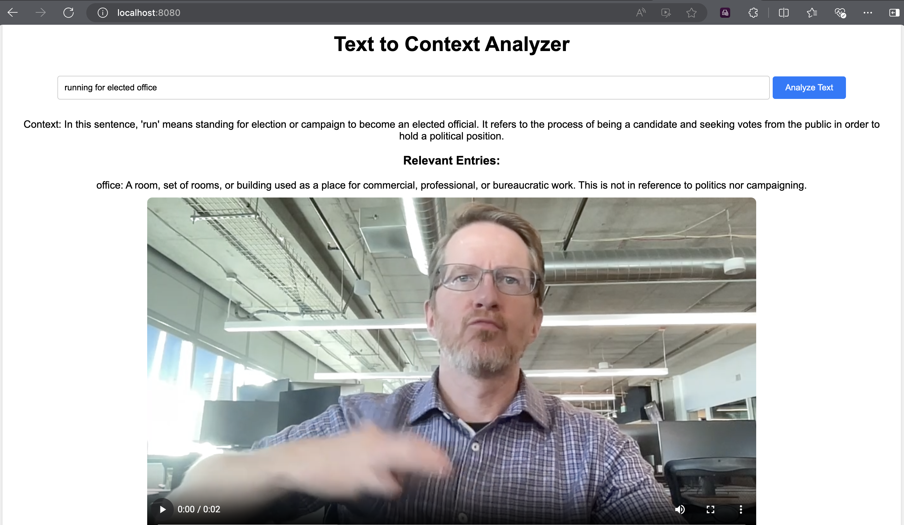

# What Run?



## The premise
There are several meanings of the word 'run'. Same with American Sign Language. We sign 'run' in different ways according to what it actually means.

## The solution
I've recorded myself signing 'run' in different ways and uploaded it. GenAI will use embedding to decipher at what context does the word run means and tries to match it against a pre-defined dictionary. It'll spit out a URL that you can paste into your browser to see which sign for 'run' is it.

## Getting started

Notes: 
- I'm not using port 5000 as AirPlay Receivers uses it on the Mac M1s, thus going for 5001.
- Get your Open AI key from https://platform.openai.com/setings/organization/api-keys
- Used Python 3.11 (along with venv and pyenv)

### local
```
$ pip install -r requirements.txt
$ export OPENAI_API_KEY="your_openai_api_key"
$ python app.py
```
Go to another terminal window:
```
$ curl -X POST http://127.0.0.1:5001/ask_context -H "Content-Type: application/json" -d '{"sentence": "I am running for president of the United States"}'
```

### docker (Mac M1)
The Dockerfile is prepared for you, but feel free to edit to your heart's content

```
$ docker build -t what-run-app:latest . 

$ docker run --rm -p 5001:5001 --env OPENAI_API_KEY="your_openai_api_key" what-run-app
```
Go to another terminal window:
```
$ curl -X POST http://127.0.0.1:5001/ask_context -H "Content-Type: application/json" -d '{"sentence": "I am running for president of the United States"}'
```

### kubernetes
Import your OPENAI_API_KEY to your Kubernetes secret *cough* storage (first, replace 'your_openai_api_key'):
```
$ kubectl create secret generic openai-secret --from-literal=OPENAI_API_KEY="your_openai_api_key"
```

Install kind, create a cluster -- plenty of instructions online somewhere. :-) 
```
$ kind load docker-image what-run-app:latest  

$ kubectl apply -f k8s-manifest.yaml 

$ kubectl port-forward svc/what-run-app-service 8080:80
```

If you made an oopsie and need to do an update:
```
$ kubectl rollout restart deployment/what-run-app 
```

Go to another terminal window:
```
$ curl -X POST http://127.0.0.1:8080/ask_context -H "Content-Type: application/json" -d '{"sentence": "I am running for president of the United States"}'
```